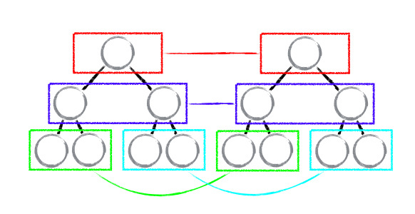
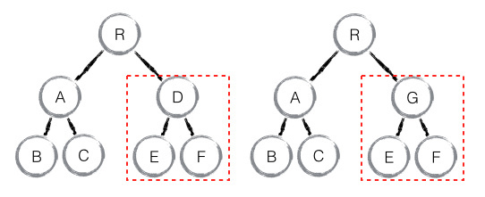

#react diff

[https://segmentfault.com/a/1190000004003055](https://segmentfault.com/a/1190000004003055)

##前提 diff策略

Web UI 中 DOM 节点跨层级的移动操作特别少，可以忽略不计。

拥有相同类的两个组件将会生成相似的树形结构，拥有不同类的两个组件将会生
成不同的树形结构。

对于同一层级的一组子节点，它们可以通过唯一 id 进行区分。

##tree diff
dom tree 上同一结点进行比较。
对树进行分层比较，两棵树的同层次节点比较

最佳实践：
1 在开发组件时，保持稳定的 DOM 结构会有助于性能的提升，例如，可以通过 CSS 隐藏或显示节点，而不是真的移除或添加 DOM 节点。

2 React 官方建议不要进行 DOM 节点跨层级的操作

##component diff
1. 如果是同一类型的组件，按照原策略继续比较 virtual DOM tree。
2. 如果不是，则将该组件判断为 dirty component，从而替换整个组件下的所有子节点。
3. 对于同一类型的组件，有可能其 Virtual DOM 没有任何变化，如果能够确切的知道这点那可以节省大量的 diff 运算时间，因此 React 允许用户通过 shouldComponentUpdate() 来判断该组件是否需要进行 diff。

##element diff
存在三种阶段操作：新增，移动，删除

按照diff原则，如果发现节点前后比较不同，就会删除原来的节点，新增节点；对于重新排序的场景，React允许开发者对同一层级的同组子节点，添加唯一 key 进行区分，变新增为移动，虽然只是小小的改动，性能上却发生了翻天覆地的变化！

访问节点需要移动的需要注意的一个条件是：新集合中的节点位置大于原来的节点，因为位置变大，意味着队列右边有新的节点位置加入（不一定是新增的），老节点往后走，才能对应新队列的位置。

##总结
* 基于组件的开发，尽量使用组件的开发，相似的功能尽量使用类似的dom结构，dom tree的层次的不同
* React 通过制定大胆的 diff 策略，将 O(n3) 复杂度的问题转换成 O(n) 复杂度的问题；
* React 通过分层求异的策略，对 tree diff 进行算法优化；
* React 通过相同类生成相似树形结构，不同类生成不同树形结构的策略，对 component diff 进行算法优化；
* React 通过设置唯一 key的策略，对 element diff 进行算法优化；
* 建议，在开发组件时，保持稳定的 DOM 结构会有助于性能的提升；
* 建议，在开发过程中，尽量减少类似将最后一个节点移动到列表首部的操作，当节点数量过大或更新操作过于频繁时，在一定程度上会影响 React 的渲染性能。
