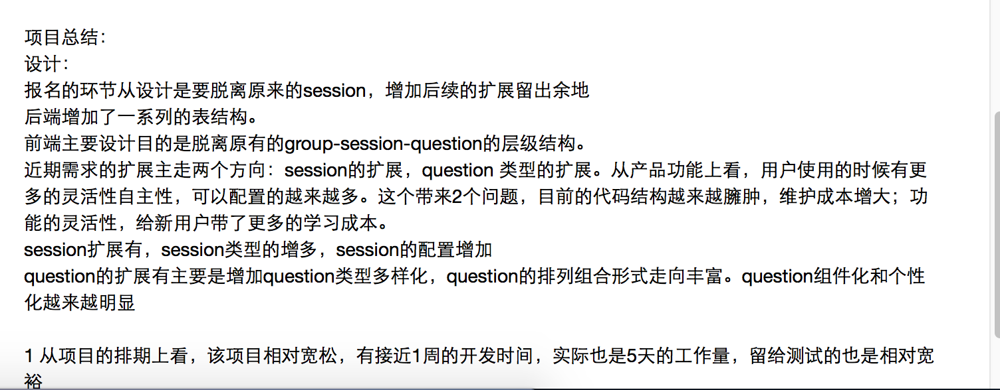
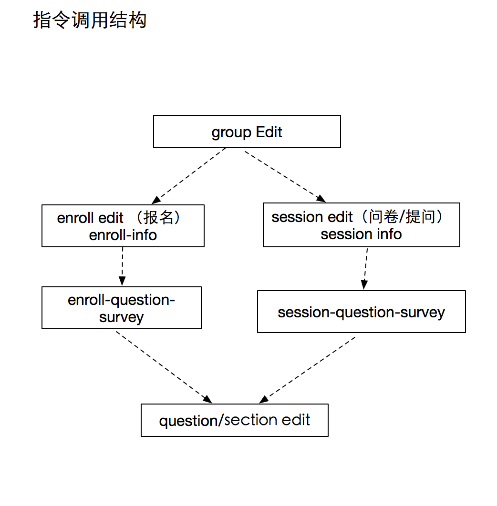

#报名项目总结

##需求理解：
   对PM的需求，需要对照现有产品对比思考，确定增加的是什么，删减的是什么，有影响有哪些？控制和了解影响范围。
  对新增功能的交互也要做好提前的预估，新增交互是否和现有的冲突，或者不一致。
排期的上问题：
   和PM，QA，RD沟通好上线的时间，了解整体的项目节奏
接口
   本次项目需要的接口很多，涉及到了对接口的问题。
##主要存在
1 ，现有接口和新接口所用功能一样的字段的名称不一致，
2 ， 新接口的错误处理和异常处理一定要和原有接口保持一致
3 ，对接口中需要的字段的类型要明确，比如是数组型，保证任何时候该字段返回的是数组
4 ，接口需要考虑web，h5，iOS， android各个端的通用性和兼容性